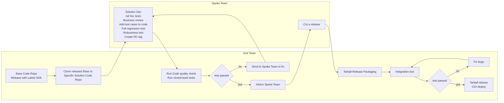

# Dev & Deploy Governance Model

```mermaid
graph LR;
  subgraph Hub Team
    H1[Base Code Repo
Release with Latest SDK]
    H1 --> H3[Clone released Base to Specific Solution Code Repo]
    H4[Run Code quality check
Run closed-book tests]
    H4 --> H6{test passed}
    H6 -->|yes| H7[Inform Spoke Team]
    H6 -->|no| H8[Send to Spoke Team to fix]
    H9[Tarball Release Packaging] --> H10[Integration test]
    H10 --> H11{test passed}
    H11 -->|yes| H12[Tarball release
CIO deploy]
    H11 -->|no| H13[Fix bugs]
    H13 --> H10
  end
  
  subgraph Spoke Team
    H3 --> S1[Solution Dev
Ad hoc tests
Business review
Add test cases to code
Full regression test
Robustness test
Create RC tag]
    S1 --> H4 
    H7 --> S5[Cut a release]
    H8 --> S1
    S5 --> H9
  end
```